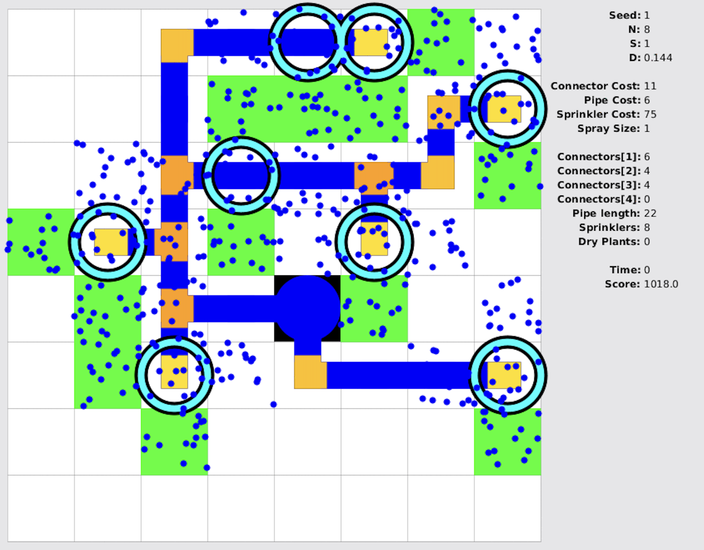
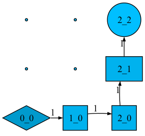
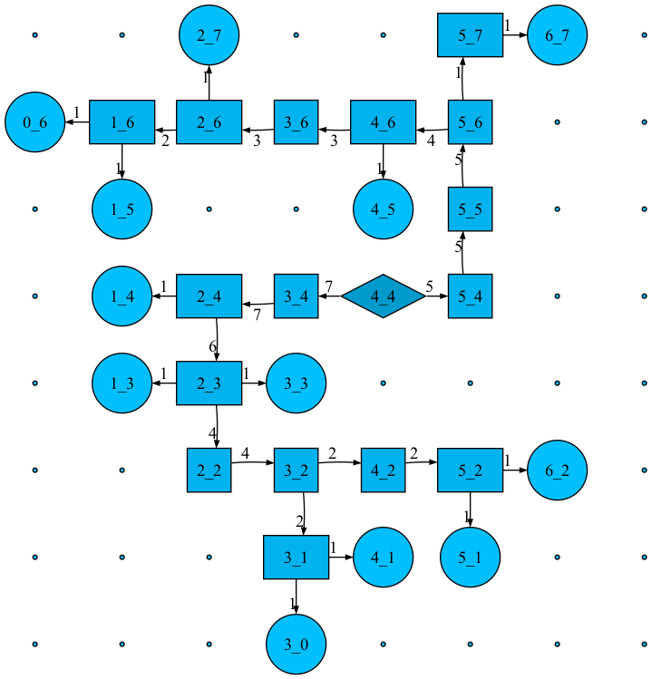

# Irrigation

This problem is the [Topcoder Marathon Match 149](https://www.topcoder.com/challenges/13d71244-c38c-49eb-84f1-c4951c1a771e) challenge.

## Optimization problem

It consists of optimizing an irrigation system to connect a source to plants via pipes and sprinklers.



The goal is to minimize the cost variable. The cost depends on following variables:

- the number of pipes
- the number of connectors on each pipes
- the number of sprinklers
- the number of un-irrigated plants

## Network flow

The implementation builds a custom network flow.
It starts from a common source node, connected to all the water source nodes.
It ends in a common sink node, connected to all the plant nodes.
Water flows from the source to the sink through pipes, with the condition of enabling sprinklers on pipes close to the plants.

### Network topology

Following rules define node adjacency:

- For source, any adjacent pipes can be connected to the source.
- For pipe, any adjacent pipes can be connected to the pipe.
- For plant, any pipes nearby can be connected to the plant.

There are 3 types of nodes:
- Source
- Pipe
- Plant

There are 3 types of arcs:
- Source -> Pipe
- Pipe -> Pipe
- Pipe -> Plant


### Constraints

- The flow out of the common source is *at most* the total number of plants.
- The flow from pipe to plant is *at most* `1`.

- Per conservation of the flow, the total flow out of a pipe is `0`. It is the sum of 
  - the opposite of the flow from any source to the pipe
  - the flow from the pipe to any other pipe
  - the flow from the pipe to any plant

- Flow can come into the pipe from exactly one other pipe or source. It can come out of the pipe into any other pipe or plant.

- Between 2 pipes, flow in the opposite direction is the opposite flow.

- The number of connectors is the number of adjacent pipes or sources. Except when there are only 2 opposite pipes, no connectors are needed.

- Flow from a pipe into a plant *can* be `> 0` only if sprinkler is installed.


See [Optimizer.buildModel](src/main/java/tech/vineyard/irrigation/optimization/Optimizer.java).

## Constraint Programming
OR-Tools [CP-SAT solver](https://developers.google.com/optimization/cp/cp_solver) gives high flexibility in defining arbitrary constraints.

It is possible to define a boolean variable for any state. To do so, define a constraint that holds when the variable is true, or false.
[Chaneling constraints](https://developers.google.com/optimization/cp/channeling) helps attaching a behavior to the variable when enabled or disabled.

## Unit Test

[Unit Test](src/test/java/tech/vineyard/irrigation/OptimizerTest.java) generates following path from source as diamond to plant as circle, with sprinkler as rectangle.



## Example

One feasible solution is to leave all plants un-irrigated.  The associated cost `N*N` needs to be paid for each *disconnected* plant nodes.

With `(N, C, P, T, Z) = (8, 1, 1, 1, 1)`, an optimal solution is:



Every arrow indicates a positive flow. Notice how the total flow of `12` is split into 2 flows of `7` and `5` at the source.
It trickles down into a flow of `1` into each plants.

### Node representation

Convention is

| Shape     | Type       |
|-----------|------------|
| diamond   | source     |
| square    | pipe       |
| rectangle | sprinkler  |
| circle    | plant      |
| dot       | empty cell |

### Graphviz

To generate image from .dot file, run following command

```
dot -Kfdp -Tpng -o irrigation.png irrigation.dot
```